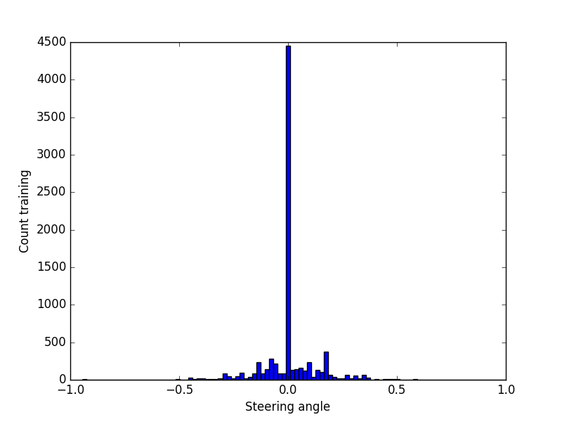

# Behavioral cloning to steer a car
This project is from [Udacity Self-Driving Car Engineer Nanodegree](https://www.udacity.com/drive) where the aim
is to teach a car to steer around a track by feeding camera images and steering angles into a Convolutional Neural Network.
 The model is not manually taught what features to prioritize (e.g. lane markings) but must create helpful features itself
 in order to predict steering angle based on the camera images.

#Data
The data used was entirely from Udacity 
[Track 1 sample data](https://d17h27t6h515a5.cloudfront.net/topher/2016/December/584f6edd_data/data.zip) which consists
of more than 8000 rows, each of which has three front-facing camera images as well as a steering wheel reading.
 Positive reading indicates right turn and negative reading left turn. For complex CNNs it's always desired to
 have access to large amounts of data in order to build a model that generalizes well.
 
 The sample data had the following distribution with a bias for driving straight.
  It was found that using this data as-is resulted in the car
  driving straight when arriving at the first corner, presumably because the model can minimize error
  by predicting steering values around 0.
 
#Data augmentation
Data augmentation can be used to create more training data without additional recording being necessary. The data
augmentation techniques used in this project are
- Horizontal flipping (removes any left/right bias that will appear in a circular lap)
- Right/left camera offset (use right and left camera images for same data point and add an offset to the steering angle)
- Brightness modification (convert to HSV color space and change V channel to simulate different lighting conditions)

#Model
The input image is cropped before being fed into the network by removing the
top and bottom 20% pixels so that the input shape is 96 x 320 pixels.
The convolutional neural network (CNN) starts with a lambda layer that normalizes the pixel values so that the range
becomes [-1 1] instead of [0 255]. The second layer is a 1 x 1 convolution with three layers which
effectively allows the model to automatically learn the ideal color space.
 
#Training
It was found that removing all data points with zero angle (straight driving) improved model performance.

Experiment with 10% of the straight driving in the data set. Worse performance. Validation error going up.

Seems like RELU performs better than ELU

Training was performed on a Macbook Pro 15" Mid 2015 in its basic configuration [(technical specs)](https://support.apple.com/kb/SP719).

- NVIDIA paper [End to End Learning for Self-Driving Cars](http://images.nvidia.com/content/tegra/automotive/images/2016/solutions/pdf/end-to-end-dl-using-px.pdf)
- Vivek Yadav [blog post](https://chatbotslife.com/using-augmentation-to-mimic-human-driving-496b569760a9#.1nbgoagsm)
- comma.ai [steering model code](https://github.com/commaai/research/blob/master/train_steering_model.py)
- Subodh Malgonde for [blog post](https://medium.com/@subodh.malgonde/teaching-a-car-to-mimic-your-driving-behaviour-c1f0ae543686#.ndr91eurb) and [code](https://github.com/subodh-malgonde/behavioral-cloning)
- Paul Heraty [forum post](https://carnd-forums.udacity.com/cq/viewquestion.action?id=26214464&questionTitle=behavioral-cloning-cheatsheet)

