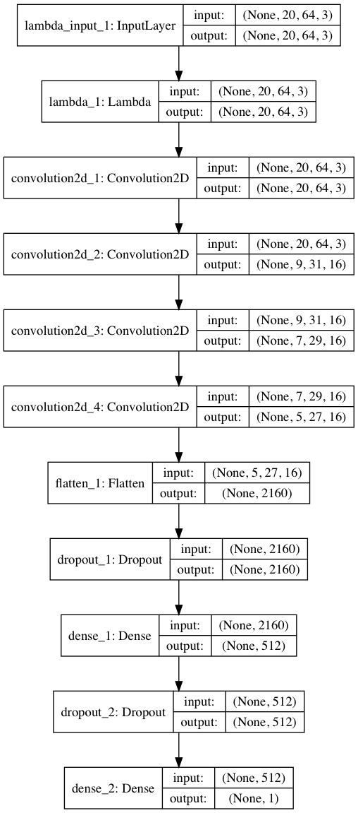

# Behavioral cloning to steer a car
This project is from [Udacity Self-Driving Car Engineer Nanodegree](https://www.udacity.com/drive) where the aim
is to teach a car to steer around a track.
Camera images and steering angles are fed into a Convolutional Neural Network.
The CNN learns to create and prioritize features that enable steering angle prediction using only images as input.

## Data
The data used was entirely from Udacity 
[Track 1 sample data](https://d17h27t6h515a5.cloudfront.net/topher/2016/December/584f6edd_data/data.zip) which consists
of more than 8000 rows, each of which has three front-facing camera images as well as a steering wheel reading.
Positive and negative readings correspond to right and left turn respectively. For complex CNNs it's always desired to
have access to large amounts of data in order to build a model that generalizes well.
 
The sample data had the following distribution with a bias for driving straight. It was found that using this data as-is resulted in the car
driving straight when arriving at the first corner, presumably because the model can minimize error
by predicting steering values around 0. By removing all rows with steering = 0 we obtain a more balanced distribution.

  
The distribution after performing data augmentation is more uniform still.
The techniques employed are described in the following section.

 
## Data augmentation
Data augmentation can be used to create more training data without additional recording being necessary. The data
augmentation techniques used in this project are
- Right/left camera offset (use right and left camera images for same data point and add an offset to the steering angle)
- Horizontal flipping (removes any left/right bias that will appear in a circular lap)
- Brightness modification (convert to HSV color space and change V channel to simulate different lighting conditions)

### Left/right camera offset
For every data point there are three camera images taken at the left, center and right of the car.
In the simulation we will predict steering angle using only the center image.

However, by adding a steering offset to the left and right images we can use these 
side camera angles from the training data. For example, the center image below
 shows a situation where the driver steers slightly right at 0.177. By adding an offset of 0.25 to the left image we
 get a harder right turn which would be necessary if driving closer to the edge as in the left image. The opposite
 adjustment is made in the right image which instead results in a slight left turn of -0.073. 

### Horizontal flip
Data was also be augmented by flipping the image and the corresponding steering angle. In addition to doubling the number
 of potential data points this technique brings a secondary important benefit. The track from which the training data was collected
 runs in a counter-clockwise direction which means that there are more left turns than there are right turns.
 By flipping images it's possible to eliminate left-turn bias which is good news for generalization potentional and therefore
   performance on unseen tracks.

### Brightness modification
The training data was collected in very bright conditions and in order to generalize better for darker conditions the images
were augmented by adjusting the brightness channel after having converted the image into HSV-format. The V channel was
multiplied by a random correction factor ranging from 0.25 to 1.00. Examples are plotted below.

Thanks to Vivek Yadav for the idea and suggestion for implementation.

## Image resolution
The input image is cropped before being fed into the network by removing the top and bottom 30 pixels.
The resulting 100 x 320 pixel image is subsequently resized by factor 5 for a final resolution of 20 x 64 pixels.
The reduction in number of pixels from 51200 to 1280 corresponds to a 97.5% reduction in pixel count. This compression
allows for much quicker calculation while maintaining a functional image input as presented in the resolution comparison.

## Model architecture
The full model architecture can be seen below.

### Normalization
The convolutional neural network (CNN) starts with a lambda layer that normalizes the pixel values so that the range
becomes [-1, 1] instead of [0, 255].

### Color space convolution
The second layer is a 1 x 1 convolution with three filters which effectively allows 
the model to automatically learn the ideal color space (credit: Vivek Yadav). This convolution
does not reduce pixel count and does not use activation since we want to conserve
 all information as input to the rest of the network.

### Convolutions
Every convolution was followed by RELU activation which seemed to work better than ELU.
The only exception was the first convolution corresponding to the color space (explained above).
The 3 main convolutions all use 16 3x3 filters which provides a good balance between necessary sophistication and training speed.
Strides decrease from 2 in the first convolution to only 1 in the following two convolutions.
This choice was made since the images were resized agressively prior to being fed into the network and further
resizing thus had to be done somewhat more carefully.

### Dropout
Dropouts were applied between the fully connected layers and it was found that fraction 0.3 was the most suitable
(i.e. keeping 70% of the features).

### Fully connected layers
After the convolutions the features are flattened and a single fully connected layer is introduced before the output.
The fully connected layer has length 512 which proved to be a good number.
Increasing this number quickly increases the number of trainable model parameters 
since the flattened layer preceeding this layer contains 2160 parameters.
Dropout is employed before and after this layer which in combination drops 51% of features.

##Training

### Straight driving data
It was found that removing all data points with zero angle (straight driving) improved model performance.
Experiments were run with re-adding a fraction of the straight driving in the data set.
Surprisingly these experiments resulted in worse performance with increasing validation error.

### Activations
It was found that removing ELU activation between the final fully connected layer and the output layer
improved performance. This finding was somewhat surprising.

### Image resolution
Most of the initial tests were run using original image resolution of 160 x 320 pixels
with models inspired by the comma.ai model and the Nvidia model.
Subsequent experiments with much smaller input images and correspondingly different models
led the development away from the Comma/Nvidia starting point to the model described here.

### Left/Right camera adjustment
Values between 0.15 and 0.40 were tried for adjusting steering when using left and right cameras
instead of center camera. Both 0.25 and 0.30 worked fine for the model.

### Optimizer and learning rate
Adam optimizer was used and learning rates tried were in the range 0.0001-0.02.
Higher learning rates than the default often produced good results with very little training
although exceeding learning rate = 0.01 often caused training to get stuck completely.
It turns out that successful models can be trained using learning rate of 0.003-0.005.

### Validation
Part of the training data is used as a validation set.
The training data was augmented using the methods explained in this document whereas the validation data
was left as-is since I didn't want to compare the prediction to artificially created images.
The distinction was performed in the generator method.

### Hardware
Training was performed on a Macbook Pro 15" Mid 2015 in its basic configuration of quad-core Haswell CPU [(full technical specs)](https://support.apple.com/kb/SP719).
No GPU available which means training time of roughly 60 seconds per epoch with 23,000 images.
Training was performed with 5-10 epochs giving total training time of 5-10 minutes using CPU only.

## Credits
- NVIDIA paper [End to End Learning for Self-Driving Cars](http://images.nvidia.com/content/tegra/automotive/images/2016/solutions/pdf/end-to-end-dl-using-px.pdf)
- Vivek Yadav [blog post](https://chatbotslife.com/using-augmentation-to-mimic-human-driving-496b569760a9#.1nbgoagsm)
- comma.ai [steering model code](https://github.com/commaai/research/blob/master/train_steering_model.py)
- Subodh Malgonde for [blog post](https://medium.com/@subodh.malgonde/teaching-a-car-to-mimic-your-driving-behaviour-c1f0ae543686#.ndr91eurb) and [code](https://github.com/subodh-malgonde/behavioral-cloning)
- Paul Heraty [forum post](https://carnd-forums.udacity.com/cq/viewquestion.action?id=26214464&questionTitle=behavioral-cloning-cheatsheet)

